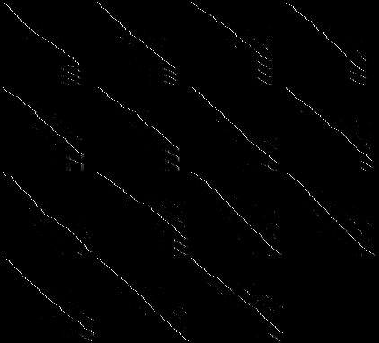

# Implementation of Automatic Speech Recognition inspired by [Listen, Attend and Spell](https://arxiv.org/abs/1508.01211) and [Attention Is All You Need](https://arxiv.org/abs/1706.03762) papers in [PyTorch](http://pytorch.org)

* Trained on LibriSpeech
* Encoder-Decoder architecture with attention
* Encoders:
    * 2D Conv network over log-mel spectrogram
    * Followed by several GRU layers
    * Or followed by several self-attention layers
    
* Decoders:
    * GRU layers with dot-product attention over encoder
    * Self-attention layers with dot-product attention over encoder

### Example spectrograms

### Corresponding attention matrices

